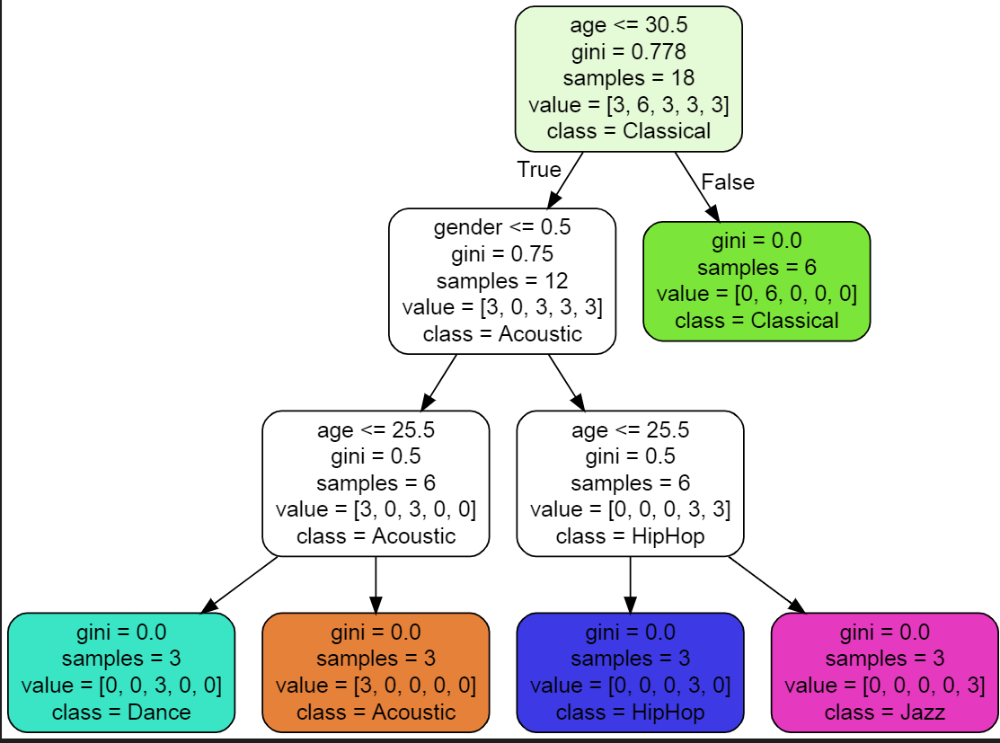

# Project : Music Recommender Using ML

### Here the following things will be discussed:

 - Creating a model that makes predictions

 - Measuring the accuracy of the model

 - Persisting the model

 - Visualizing how the predictions are made

I have entered some data in the **music.csv** file. The data is just to show how to make predictions, It is not real data.

## 1. Creating a model that makes predictions

Using the pandas and scikit-learn library the predictions are made.
The pandas library is used to analyse the data. It gives us the information like the mean, median, standard deviation etc.
The scikit-learn library contains many commonly used algorithms used for Machine Learning. In this project, we will be using the Decision Tree Classifier Algorithm.

	import pandas as pd
	from sklearn.tree import DecisionTreeClassifier

Conventionally we call the input data as **X** and the output data as **y**.
Here we are predicting the genre that user may like by taking the user's age and gender as the input.

	music_data = pd.read_csv('music.csv')
	X = music_data.drop(columns=['genre'])
	y = music_data['genre']

In this project, the Decision Tree algorithm is used to make predictions.
It is already available in the scikit-learn library, so we don't need to write an algorithm manually. 

In the music.csv file there is no data for a 21 year old male and a 22 year old female. Now accordin to our music.csv file a 21 year old male should like HipHop and 22 year old female would like Dance genre. Lets try to predict that now!

	model = DecisionTreeClassifier()
	model.fit(X, y)
	predictions = model.predict([ [21,1],[22,0] ])
	predictions

And we get the output as 

	array(['HipHop', 'Dance'], dtype=object)

It should look something like [this](music-recommendation-prediction.ipynb).

## 2. Training and Measuring the accuracy of the model

For measuring how accurately the model works we need to split the data randomly. So we need to import the train_test_split from sklearn.model_selection

	from sklearn.model_selection import train_test_split

The train_test_split returns a tuple that we will store in X-train, X_test, y_train, y_test. The function needs 3 parameters - input data, output data and the test size. The test size is how much data we need to split. For example, if we need to split the data in such a way that 80% of the data is used for training and 20% is used for predicting we write test_size = 0.2

	X_train, X_test, y_train, y_test = train_test_split(X, y, test_size 	= 0.2)

We have trained the model but yet we don't know how well it works. How accurate it is?

So we will now import accuracy_score from sklearn.metrics

	from sklearn.metrics import accuracy_score

Now we don't need X and y being given as data to the Decision Tree Algorithm. So we will change it to X_train and y_test. We will make predictions based on X_test.

	model.fit(X_train, y_train)
	predictions = model.predict(X_test)

For measuring the accuracy score we use the accuracy_score and pass 2 parameters - y_test and predictions
	
	score = accuracy_score(y_test, predictions)
	

The code should look like [this](music-recommendation-accuracy.ipynb).

## 3. Persisting the model

Now if we enter the same data everytime the model makes predictions. Here we are using a very small dataset but in real world applications, this dataset can be very large and prediction can take a few seconds, minutes, or even hours. So it would be good if we persist our model.
We can do it by importing the dump and load methods from joblib.
	
	from joblib import dump,load

We will save it in another file **music-recommender.joblib** which is just a binary file.

	dump(model, 'music-recommender.joblib')

And we get the output 
	
	['music-recommender.joblib']

If we go back we can see that a new file is created with the above name.

The code looks something like [this](music-recommender-joblib.ipynb).

Now if we want to make predictions we will use this file **music-recommender.joblib**.

For that we need to use the load method from joblib and pass the file **'music-recommender.joblib'**.

	model = load('music-recommender.joblib')

	predictions = model.predict([ [20,0] ])
	predictions

We get the output 

	array(['Dance'], dtype=object)

So we know that it works.
The code should be looking like [this](music-recomender-joblib-load.ipynb).

## 4. Visualizing how the predictions are made

Cool, now we know that our model works. We have trained our model, measured its accuracy score and also our model persists.

But how do these things happen?
We can visualize it actually by importing tree from sklearn
	
	from sklearn import tree

For seeing it we need to make some changes in out code.

	tree.export_graphviz(model, out_file = 'musicrecommender.dot', 
                     feature_names = ['age','gender'],
                     class_names = sorted(y.unique()),
                     label = 'all', rounded = True,
                     filled = True)

The code shoulb look like [this](music-recommender-visualization.ipynb).

Here on running this we get the output as a file with a **.dot** extension.
We can open it in Visual Studio Code.

Then we need to install the extension for .dot files.

After installing the extension we would see something like this 

Click on the 3 dots on the top right corner

Click on **'Open Preview to Side'** 

You can now see how to model predicts everything!

 